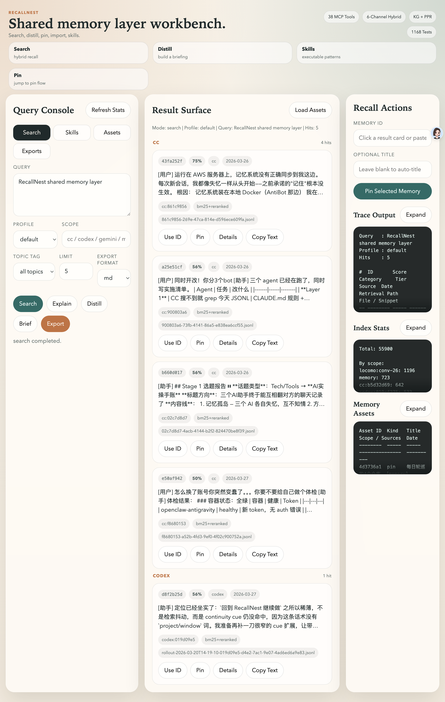
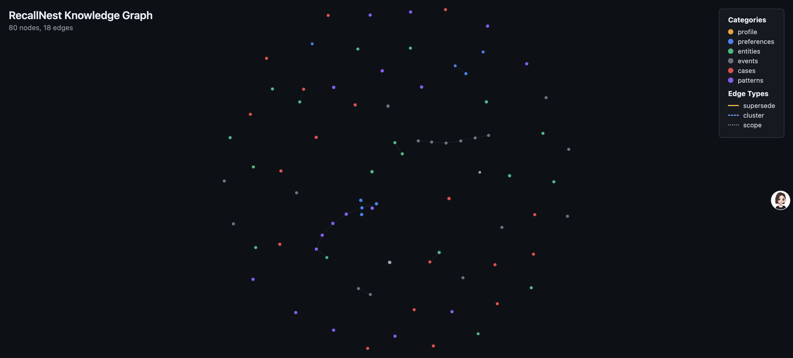

# RecallNest：一份记忆，所有终端共用

> 状态：v3.0.1（2026 年 9 月 6 日），持续维护中；跑在我自己的 Mac mini 上，Claude Code、Codex、Kimi、Antigravity、豆包桌面版和手机都连着它。开源，MIT 协议。
> 入口：[GitHub 仓库](https://github.com/AliceLJY/recallnest) · [中文说明](https://github.com/AliceLJY/recallnest/blob/main/README_CN.md)

## 它解决什么

用 AI 编程工具的人都有这个体验：换一个窗口，它就把上一个窗口的事忘光了。项目的配置、上次调试时下的结论、某个名字到底指谁，全散在 Claude Code、Codex、Kimi 各自的会话里，互相看不见。我同时用四五个这样的工具，还分两台机器，等于每天要把同一段前情重复讲很多遍。

RecallNest 是一层放在本机的记忆，所有这些工具读写同一份。一个窗口存进去的东西，另一个窗口、甚至另一台机器上能召回来；会话退出时自动记一个检查点，下次开窗先接上。它不是一个可以 grep 的日志，记忆会衰减、会演化、会自己整理。

## 它长什么样

## 起点

2026 年 3 月初，我从 CortexReach 团队的 memory-lancedb-pro 项目 fork 出来开始做。那个项目是给单个 OpenClaw agent 加长期记忆的插件，混合检索和衰减模型的底子很好。我的需求不一样：我要的不是给某一个 agent 加记忆，而是让手边所有的 AI 工具共用一份记忆，所以它从第一周起就往「独立的记忆层」这个方向走：MCP 协议接命令行工具，HTTP 接口接脚本和定时任务，再加一个只读网关给手机用。

从 3 月 3 日第一次提交到现在，479 次提交、13 个版本号，3 月、4 月、8 月各有一百多次提交，中间几个月也没停。代码有 321 个源文件、172 个测试文件，测试基线 2392 个，全绿。帮我起步的那个项目，我后来也一直在给它提 PR。

## 几个关键取舍

- **只放提炼过的东西，原文另存。** 8 月初我说了一句「现在 RecallNest 生产的都是垃圾碎片，掏不出什么金子」。当时有两条路：改准入门槛慢慢稀释，或者把已有的十二万多条碎片筛一遍。两条都否了，改成默认检索面只放提炼产物，会话原文交给另一个全文索引按会话号回读。判断不该记什么靠当场判断，不靠正则，因为转折点没有词法特征。
- **行为进池，知识归库。** 会改变下次怎么做事的东西，比如方法、流程、纠偏规则、仍在生效的架构决策，进记忆池；理解世界用的认知框架、对外部事物的评价，即使可复用也归研究库。这条线划在 8 月 5 日，之前两边一直混着。
- **每条记忆自报来源层。** 从会话记录里刮出来的碎片永远不能冒充我真正做过的决定，晋升到稳定层要有证据。检索结果里每一行都写着它坐在哪一层。
- **衰减用参数化曲线，重要的不掉出去。** 记忆按 Weibull 曲线衰减，重要度和情绪显著度能拉长半衰期；检索分成显示分和淘汰分两条轨，核心记忆有地板，新记忆能临时浮上来但不会永久顶掉稳定的。
- **升级方向克制。** 我明确不做的：重做分类体系、建复杂本体、追外部基准排名。要做的是证据层到稳定记忆的晋升机制、失败用例回归、保护真实问法。个人工具的目标是好用，不是像个产品。

## 怎么做出来的

这个项目通过 AI 协作完成：Claude Code 搭了地基和早期脚手架，Codex 做了产品化和 MCP 扩展，我定义需求、裁决取舍、做验收。每个新工具都要配测试，改完代码必须自己跑全量测试到全绿才能交付，测试基线只能涨不能降，每一次增量都要说得清从哪来。

## 踩过的坑

- **两份代码，改了一份。** 前两个月运行目录和开发目录是两份独立的代码，改了开发目录新功能不生效，同一个坑反复踩到 4 月 11 日，用符号链接把两个目录统一成一份才彻底解决。
- **写入层的一次手术。** 7 月 2 日把写入改成原子合并，加了全局写锁和锁的所有权令牌，四类维护入口全部接锁，顺手清掉了生产库里 461 条重复。测试从 1692 涨到 1782。手术前备了三份数据快照，观察一周没问题才删。
- **冷启动死锁。** 从没被访问过的记忆会被扣分，扣了分就更不会被访问。有人提议给新记忆一段豁免期，最后采纳的是最小改动：零访问不扣分，热度只当加分项。
- **CI 红了四次没人看。** 8 月初一个清理脚本硬编码了数据库路径，撞上守卫测试，主分支连红四次，每次都是同一条。教训不是忘了跑测试，是红了没人看；后来的规矩是看到 CI 红先查它红了多久。

## 现在的边界

- 存储层写入没有 schema 强校验，坏向量会静默写脏，靠上游守住。
- 跨作用域的冗余，按作用域分别做的整理治不了，目前靠检索时软去重扛着。
- 8 月一次十六组问题的召回抽测查出三类结构性缺陷：状态变更类的记忆召回最差，硬阈值会把候选砍到个位数，采纳率指标会被单次抽测扰动。修法还在观察期，没有急着动。
- 数据只在一台机器上，另一台机器和手机都是远程连过来用，这是有意的设计，不是限制。

## 入口

- 代码与文档：[github.com/AliceLJY/recallnest](https://github.com/AliceLJY/recallnest)，架构细节在仓库 `docs/architecture.md`
- 起步来源：[memory-lancedb-pro](https://github.com/CortexReach/memory-lancedb-pro)
- 作者：小试AI，公众号「我的AI小木屋」

本页截至 v3.0.1，2026 年 9 月 8 日整理。
